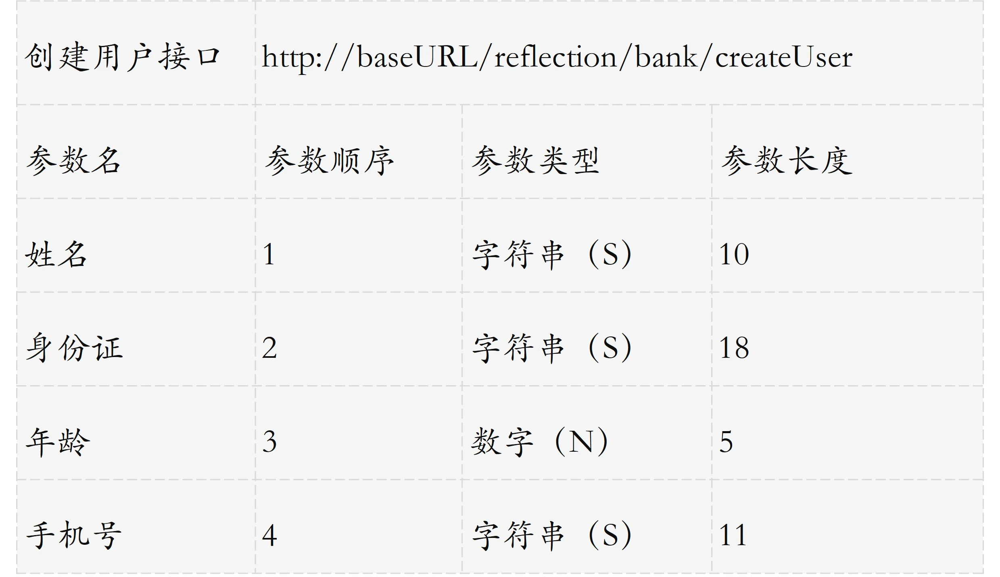
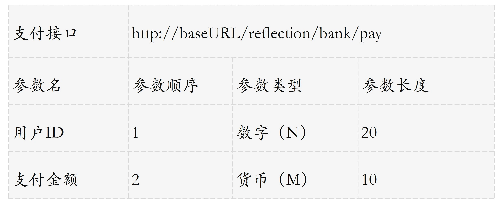

三方接口的调用案例

假设银行提供了一些 API 接口，对参数的序列化有点特殊，不使用 JSON，而是需要我们把参数依次拼在一起构成一个大字符串。

- 按照银行提供的 API 文档的顺序，把所有参数构成定长的数据，然后拼接在一起作为整个字符串。
- 因为每一种参数都有固定长度，未达到长度时需要做填充处理：
  - 字符串类型的参数不满长度部分需要以下划线右填充，也就是字符串内容靠左；
  - 数字类型的参数不满长度部分以 0 左填充，也就是实际数字靠右； 
  - 货币类型的表示需要把金额向下舍入 2 位到分，以分为单位，作为数字类型同样进行左填充。
- 对所有参数做 MD5 操作作为签名（为了方便理解，Demo 中不涉及加盐处理）。

比如，创建用户方法和支付方法的定义是这样的：

- 三种标准数据类型的处理逻辑有重复，稍有不慎就会出现 Bug； 
- 处理流程中字符串拼接、加签和发请求的逻辑，在所有方法重复； 
- 实际方法的入参的参数类型和顺序，不一定和接口要求一致，容易出错； 
- 代码层面针对每一个参数硬编码，无法清晰地进行核对，如果参数达到几十个、上百个，出错的概率极大。

许多涉及类结构性的通用处理，都可以按照这个模式来减少重复代码。反射给予了我们在不知晓类结构的时候，按照固定的逻辑处理类的成员；而注解给了我们为这些成员补充元数据的能力，使得我们利用反射实现通用逻辑的时候，可以从外部获得更多我们关心的数据。
